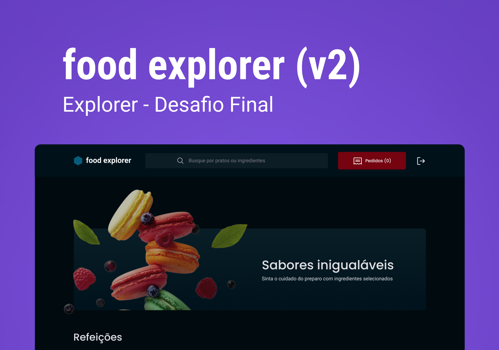

<h1 align="center" style="text-align: center;">
  Food Explorer - FrontEnd
</h1>

<p align="center">
  <a href='https://foodexplorer-frontend-topaz.vercel.app/' target="_blank">
🚀Acesse o projeto aqui🚀
</a>
</p>

<p align="center">
  
</p>

## 📁 Projeto

Neste desafio, foi desenvolvido o food explorer, um menu interativo para um restaurante fictício.
Uma aplicação completa que vai desde a visualização de um prato até o pagamento do mesmo, bem como a versão mobile do projeto.

O food explorer terá duas personas: o admin e o usuário;

O admin é a pessoa responsável pelo restaurante, logo, poderá criar, visualizar, editar e apagar um prato a qualquer momento. Cada prato deve conter uma imagem, um nome, uma categoria, uma breve descrição, os ingredientes e o seu preço. Ao clicar em adicionar prato, o admin receberá uma mensagem de sucesso e será redirecionado para a página principal;

O usuário irá visualizar todos os pratos cadastrados e, quando clicar em um prato, será redirecionado para uma nova tela com informações mais detalhadas sobre ele.

## 🚀 Tecnologias

Esse projeto foi desenvolvido com as seguintes tecnologias:

- ReactJS
- Vite
- Styled Components
- JavaScript
- NodeJS
- Sqlite
- Axios
- Swiper
- Express

## 💻 Instalação e execução - BACKEND

<a href='https://github.com/willdjm/api-foodexplorer' target='_blank'>
https://github.com/willdjm/api-foodexplorer
</a>

```bash
npm install
npm run migrate
npm run dev
```

## 💻 Instalação e execução - FRONTEND

<a href='https://github.com/willdjm/foodexplorer-frontend' target='_blank'>
https://github.com/willdjm/foodexplorer-frontend
</a>

```bash
npm install
npm run dev
```

## 👨‍👩‍👧‍👦 Acessos

```bash
  Administrador:
  E-mail: admin@email.com
  Senha: 123456
```

```bash
  Cliente:
  E-mail: cliente@email.com
  Senha: 123456
```

## :memo: Licença

Esse projeto está sob a licença MIT.

---